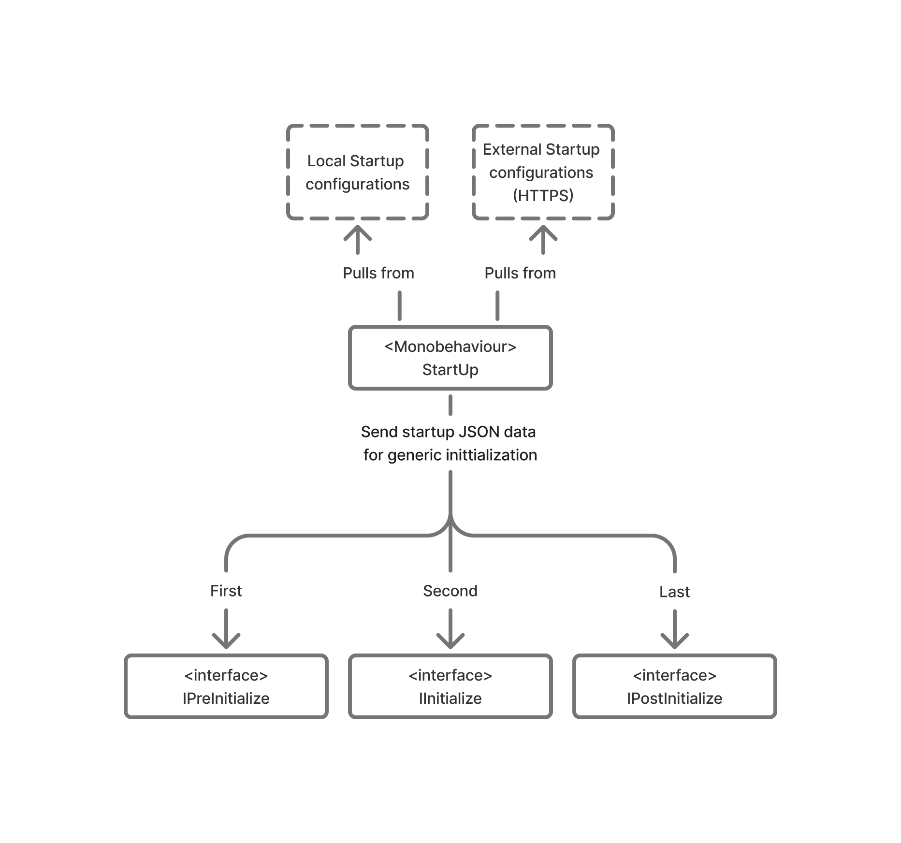
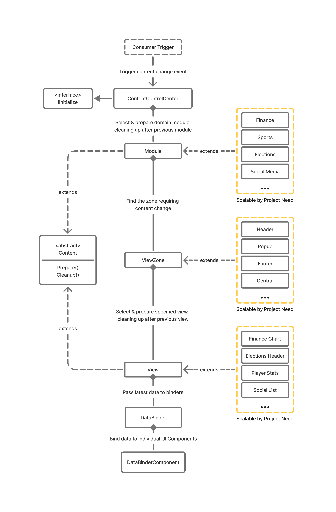

# Case Study: Data-Driven Interactive Touchscreen Framework for Broadcast (Unity)

A modular, event-driven Unity framework designed to power real-time interactive touchscreen experiences in broadcast environments. Built to support deterministic startup, dynamic content composition, and live data interaction while remaining flexible for designers and integrators.

---

## Design Philosophy

This framework was designed around **predictability, modular ownership, and data-driven interaction**.  
In live broadcast scenarios, interactive systems must boot reliably, respond instantly to user input, and remain adaptable under tight iteration constraints.

Key principles:
- Deterministic startup and initialization  
- Event-driven, loosely coupled systems  
- Data-driven configuration and content definition  
- Clear separation between framework logic and show-specific content  
- Designer and integrator-friendly extension points  

The systems below demonstrate how these principles were applied across startup orchestration, content management, and interactive data binding. Expand a summary to explore the design challenge, technical approach, and resulting impact.

---

## Relevant Tech Stack

---

## Framework Breakdown

  
<strong>"Deterministic Startup & Initialization Pipeline"</strong> 
  A centralized startup system that guarantees predictable initialization order and safe dependency injection, which in turn vastly improved initialization stability and scalability by enforcing loose coupling for all intializable systems.

  <blockquote>

  <h3>Outcome</h3>
  

    Ensured reliable, repeatable application startup across development, staging, and live broadcast environments, improving stability, scalability, and reliability.
  

  <h3>Responsibilities</h3>
  <ul>
    <li>Designed a centralized startup controller to orchestrate system initialization</li>
    <li>Defined explicit initialization phases to resolve dependencies safely</li>
    <li>Supported local and remote configuration loading</li>
    <li>Handled startup failure states and recovery paths</li>
  </ul>

  <h3>Challenge</h3>
  

    Unity applications with multiple interconnected systems often suffer from non-deterministic startup behavior, race conditions, and fragile initialization order — issues that are unacceptable in live broadcast environments.
  

  <h3>Solution</h3>
  

    Introduce a deterministic startup pipeline that initializes systems in a flexible yet defined sequence, ensuring each subsystem only activates once its dependencies are ready. This guarantees a stable and predictable runtime state.
  

  <h3>Impact</h3>
  <ul>
    <li><strong>Before ➙</strong> unpredictable startup order causing intermittent bugs and hard-to-reproduce failures.</li>
    <li><strong>After ➙</strong> fully deterministic startup behavior with decoupled logic to enable effortless scaling of new initializable systems.</li>
  </ul>

  <h3>Key Learnings</h3>
  <ul>
    <li>Explicit initialization phases dramatically improve system stability and reliability</li>
    <li>Predictable startup and agile system scalability is critical for high-stakes, live environments</li>
  </ul>

  </blockquote>

  
<strong>"Interactive Content Management Pipeline"</strong> 
  A modular, data-driven system for composing and switching interactive touchscreen content at runtime, providing design freedom through component-driven data binding and quick integration turnarround through abstracted out transition logic.

  <blockquote>

  <h3>Outcome</h3>
  

    Enabled rapid iteration and dynamic composition of interactive screens by abstracting out transition logic and keeping all content self contained and pluggable into the existing framework.
  

  <h3>Responsibilities</h3>
  <ul>
    <li>Designed a content management layer to control screen composition</li>
    <li>Defined data-driven content definitions using JSON</li>
    <li>Enabled runtime content switching and layout reconfiguration</li>
    <li>Maintained separation between framework systems and show-specific logic</li>
  </ul>

  <h3>Challenge</h3>
  

    Interactive touchscreen projects often hard-code content logic directly into scenes or scripts, making iteration slow and increasing the risk of regressions when layouts change. Iteration speed is key in high-paced, high-stakes environments such as live broadcast and any regression bugs or iteration speed hurdles affect development credibility and client satisfaction.
  

  <h3>Solution</h3>
  

    Abstract out interactive content into modular units defined by data rather than code. The framework instantiates and manages content dynamically, allowing layouts and interactions to evolve without touching core systems.
  

  <h3>Impact</h3>
  <ul>
    <li><strong>Before ➙</strong> content changes required code modifications and often introduced bugs to other content due to their tightly couple nature.</li>
    <li><strong>After ➙</strong> interactive content reconfigured through data with minimal engineering involvement.</li>
  </ul>

  <h3>Key Learnings</h3>
  <ul>
    <li>Data-driven content pipelines significantly reduce iteration time</li>
    <li>Strong boundaries between framework and content improve long-term maintainability</li>
  </ul>

  </blockquote>

  
<strong>"Event-Driven Interaction & Data Binding Layer"</strong> 
  A reactive data binding system that synchronizes live data, user input, and UI while keeping everything component-driven for decoupled integration and quick iteration..

  <blockquote>

  <h3>Outcome</h3>
  

    Enabled responsive, real-time UI updates and interactions while preserving a clean, component-based workflow.
  

  <h3>Responsibilities</h3>
  <ul>
    <li>Designed a subscription-based data binding model</li>
    <li>Implemented event-driven updates for UI and interaction systems</li>
    <li>Supported plug-and-play binding components for designers</li>
    <li>Provided manual and automatic update control for performance tuning</li>
  </ul>

  <h3>Challenge</h3>
  

    Synchronizing UI and interaction logic with live or rapidly changing data often leads to polling-heavy systems, duplicated logic, and tightly coupled dependencies.
  

  <h3>Solution</h3>
  

    Introduced an event-driven subscription model where components react only to relevant data changes. This removed the need for polling while giving designers flexible, component-based access to live data.
  

  <h3>Impact</h3>
  <ul>
    <li><strong>Before ➙</strong> polling-based updates and duplicated interaction logic increased complexity.</li>
    <li><strong>After ➙</strong> reactive, plug-and-play components with cleaner architecture and faster iteration.</li>
  </ul>

  <h3>Key Learnings</h3>
  <ul>
    <li>Event-driven interaction scales better under live data conditions</li>
    <li>Component-based binding empowers designers while protecting system integrity</li>
  </ul>

  </blockquote>

---

## Framework Overview
*Diagrams shown are conceptual and represent high-level architectural patterns.
Names and structures have been generalized to avoid disclosure of proprietary implementations.*

### Startup & Initialization Lifecycle
> Illustrates the deterministic initialization life cycle implemented for dependency injection allow configuration from both local and external sources depending on project need.
> 
> 

### Interactive Content Management Pipeline
> Displays the modular system designed to control data-driven content while abstracting out any framework logic. All downstream elements are only responsible for their own behvaiour with no knowledge of higher level components, leading to more flexibility in integration and design, as well as a more maintainable code base through proper seperation of concern.
> 
> 
